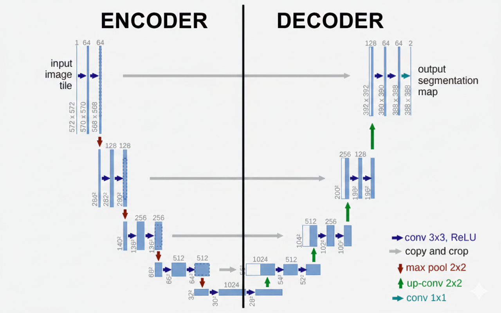
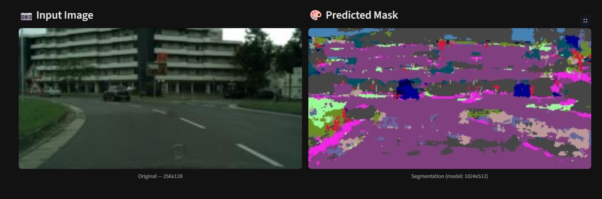
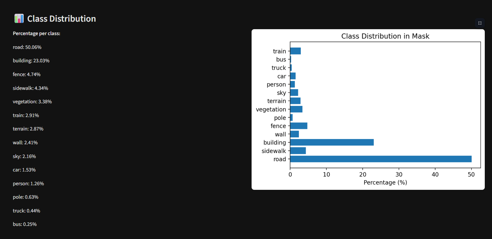

# 🏙️ UrbanSceneSeg: Semantic Segmentation

 


 

A comprehensive deep learning project dedicated to the **Semantic Segmentation** of urban street scenes. Built entirely with **PyTorch**, this project leverages the complex **Cityscapes dataset** to train a robust model capable of understanding and classifying various urban elements at a pixel level.

---

## 📖 Table of Contents

- [📌 CI/CD](#-cicd)
- [✨ Features](#-features)
- [📊 Dataset & Preprocessing](#-dataset--preprocessing)
- [🧠 Model Architecture & Pipeline](#-model-architecture--pipeline)
- [🌐 Interactive Web App](#-interactive-web-app)
- [🚀 Getting Started (Local & Docker)](#-getting-started-local--docker)
- [📈 Evaluation Metrics](#-evaluation-metrics)
- [🖼️ Demo & Visuals](#️-demo--visuals)
  
---

## 📌 CI/CD


---

## ✨ Features

- **Custom U-Net Architecture:** A from-scratch implementation of the U-Net architecture natively in PyTorch.
- **Transfer Learning Integration:** Utilizes pre-trained backbone weights to accelerate convergence and drastically improve feature extraction.
- **Advanced Class Imbalance Handling:** Implemented a custom weighting strategy in the loss function to dynamically adjust penalties. This ensures the model accurately learns minority classes (e.g., pedestrians, traffic lights) without being overwhelmed by dominating classes (e.g., roads, skies).
- **Custom Mask Decoding:** Includes a `decode_segmap` utility to map categorical tensor predictions back to standard RGB color spaces for intuitive visualization.
- **Interactive Streamlit Web App:** A user-friendly frontend interface that allows users to upload custom images and view segmentation masks in real-time.
- **Containerized Environment:** Fully reproducible development and production environment using Docker.
- **Automated CI/CD:** Integrated GitHub Actions pipeline to ensure code quality and verify successful builds.

---
## 📊 Dataset & Preprocessing

This project utilizes the **Cityscapes Dataset**, focusing on semantic understanding of urban street scenes. 

### Data Pipeline Workflows:
1. **Custom PyTorch Dataset:** A fully customized `Dataset` class designed to load images and their corresponding segmentation masks efficiently.
2. **Transformations & Normalization:** Input images are normalized using standard ImageNet mean (`[0.485, 0.456, 0.406]`) and standard deviation (`[0.229, 0.224, 0.225]`) to align with the pre-trained weights of the encoder.
3. **Tensor Conversion:** Masks are processed strictly as un-normalized tensors to maintain class indices for the Cross-Entropy loss calculation.

---

## 🧠 Model Architecture & Pipeline

This project is built around the **U-Net** architecture, customized specifically for urban scene parsing:

- **Encoder (Downsampling):** Extracts high-level semantic features using transfer learning from a pre-trained backbone. This allows the model to leverage robust, generalized feature representations.
- **Decoder (Upsampling):** Utilizes transposed convolutions combined with skip connections from the encoder. This ensures that fine-grained object boundaries and precise spatial dimensions are recovered during upsampling.
- **Weighted Loss Strategy:** To combat the dataset's natural imbalance, we utilize `nn.CrossEntropyLoss` combined with a calculated weight tensor. Minority classes receive higher penalty weights, forcing the network to focus on them during backpropagation.
- **Inference Pipeline:** During evaluation, `torch.no_grad()` is utilized for memory efficiency. The output tensors are passed through an `argmax` function over the class dimension to generate the final 2D predicted map.

---

## 🌐 Interactive Web App

The project includes an interactive web application built with **Streamlit**. The app seamlessly bridges the complex PyTorch backend with an intuitive user interface. 

Users can:
- Upload their own street scene images.
- Adjust model confidence thresholds (if applicable).
- Instantly view the original image side-by-side with the generated color-mapped semantic mask.

---

## 🚀 Getting Started (Local & Docker)

You can run this project either locally on your machine using standard Python environments or within an isolated Docker container.

### Prerequisites

- Python ≥ 3.10 (Python 3.12 is recommended)
- Docker & Docker Compose (for containerized execution)

### 1. Local Installation

To install the required dependencies via pip, run the following commands:

```bash
# Clone the repository
git clone [https://github.com/0AliPrs0/UrbanSceneSeg.git](https://github.com/0AliPrs0/UrbanSceneSeg.git)
cd UrbanSceneSeg

# Create a virtual environment (Optional but recommended)
python -m venv venv
source venv/bin/activate  # On Windows: venv\Scripts\activate

# Install dependencies
pip install -r requirements.txt
```

### 2. Running with Docker (Recommended)

To avoid dependency conflicts and ensure a perfectly reproducible environment, use Docker. Make sure Docker Desktop or Docker Engine is running.

```bash
# Build the image and start the container
docker compose up --build
```
This command will read the `docker-compose.yml`, build the PyTorch environment, install dependencies, and spin up the services automatically.

---
## 📈 Evaluation Metrics

The model's performance was rigorously evaluated on the validation split of the Cityscapes dataset. Despite the highly imbalanced nature of the data, the model achieved reliable baselines:

- **Mean Intersection over Union (mIoU):** ` 41.96%`
- **Global Pixel Accuracy:** ` 63.77%`

These metrics demonstrate that the model effectively captures both dominant structures (like roads and buildings) and smaller, critical objects (like pedestrians and traffic signs).

---

## 🖼️ Demo & Visuals

Below are visual representations of the model's architecture, its performance compared to ground truth masks, and the application demo.

### 1. Model Architecture
A high-level diagram of our custom PyTorch U-Net implementation.




### 2. Streamlit Application Demo
A snapshot of the working interactive UI where users can upload images and get real-time segmentation results.




